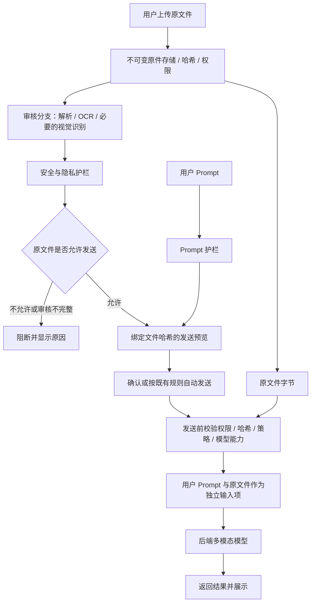

# 附件护栏审核与原文件透传：开发计划

修订日期：2026-09-07。状态：实施中；阶段性进度见文末，尚未完成原件透传主流程切换。

## 1. 修订结论与职责边界

本工具识别附件内容的唯一业务目的，是进行安全和隐私审核。文件问答、总结、提取、计算等后续任务由目标后端多模态模型及其文件处理能力完成。

目标流程：用户 Prompt + 通过审核的原文件 -> 后端模型 -> 模型结果。

网关不得把 OCR 文字、提取正文、内容摘要或审核摘要拼入业务 Prompt 来替代附件，也不应为业务理解改写、转换、裁剪、压缩或重新生成发送文件。传输层封装、无损 Base64 编码和供应商文件 ID 引用可以使用，但底层上传内容必须与用户原文件字节一致。

“原文件不处理”指发送给目标模型的文件不做内容变换；网关仍需读取原件并在独立审核分支生成内部解析/OCR/渲染副本。这些副本仅供护栏使用，不进入业务模型请求。

需要区分当前实现与本次目标：已核对的现有 chat_service.py 仍把附件前 12000 个字符拼入用户消息后发送，并未透传原文件。本计划定义把现有实现改为原文件透传。

## 2. 核心约束

- 原件不可变：保存 SHA-256、字节长度、真实文件类型和版本。
- 用户 Prompt、原文件引用、护栏识别产物分开存储、传输和显示。
- 本地识别结果仅服务于护栏判定、必要的审核预览和受控审计。
- 审核结果绑定原件哈希、扫描器版本与策略版本；审核对象与实际发送对象必须一致。
- 未识别、部分识别、扫描超时、调用失败、静默截断均不能标记为审核通过。
- 只有具备相应原生格式接收能力且通过适配测试的 provider/model 才允许发送该附件。
- 后端模型支持图像不等于支持 DOCX/PDF/XLSX 文件输入；不能假定所有 OpenAI 兼容接口支持相同附件协议。
- 目标模型对原件如何解析属于其自身能力；网关不承诺其完整读取或准确理解全部格式信息。
- 不支持的格式明确报错，不自动转换或退回“提取文字发送”。
- 本计划不新增对外传输授权，不改变现有企业高风险阻断规则。

## 3. 两条独立的数据路径



只有审核通过并满足确认条件后，才能上传到目标供应商的 Files API 或其他远端存储。文件预上传本身也是外发，不能在审核前为了降低延迟提前执行。

## 4. 本次从上一版移除的工作

| 上一版工作 | 修订后处理 |
|---|---|
| 本地附件问答 RAG、embedding、向量库、reranker | 移除；业务文件理解交给后端模型 |
| 根据用户问题挑选页面或内容块发送 | 移除；发送通过审核的原文件 |
| 本地 TaskPlan 分流问答/总结/提取/计算 | 移除；用户 Prompt 直接表达任务 |
| 本地表格计算沙箱、章节总结、文档比较引擎 | 移除 |
| 为业务请求生成页面截图、裁剪图、摘要 | 移除；审核内部仍可生成派生资料 |
| 图像/PDF 脱敏副本发送 | 移除；原件不改写 |
| 本地证据重排与业务上下文预算 | 移除；保留供应商文件大小/数量/格式等限制校验 |
| 人工拼接证据引用和文档级答案校验 | 不纳入首版；目标模型支持引用时可展示其返回结果 |
| 预览快照 | 保留，但绑定 Prompt、原件与审核决定，而不是提取内容 |
| 文档版本、覆盖、持久化任务、权限和审计 | 保留，服务于可靠审核和一致发送 |

不需要引入 pgvector 或以问答为目的构建完整 Document IR。仅扩展护栏确实需要的结构、位置、视觉资源与覆盖信息。

## 5. 审核分支：识别内容只交给护栏

### 5.1 文件解析

| 格式 | 内部审核处理 | 实际发送 |
|---|---|---|
| PDF | 提取原生文字与位置；混合页检查图片/绘图；必要时页面渲染和 OCR/视觉扫描 | 原 PDF 字节 |
| DOCX | 按顺序读取段落、表格、图片，明确页眉页脚、批注、修订等审核范围 | 原 DOCX 字节 |
| DOC | 有可用隔离转换器时生成审核副本；转换不充分时 unknown | 原 DOC 字节，且要求目标接口支持 |
| JPEG/PNG 等图片 | OCR + 必要视觉扫描；OCR 为空不能视为安全 | 原图字节 |
| XLSX | 保留单元格关系，覆盖策略要求的公式、隐藏内容等 | 原 XLSX 字节 |
| PPTX | 文字、图片及必要的整页视觉审核，明确备注范围 | 原 PPTX 字节 |

内部审核副本与原件分别存储。若审核无法覆盖原件中的某类内容，记录具体盲区，不因副本解析成功就宣称原件已完整审核。

扫描 PDF 不能“有文本就跳过整页图片”。表格不能删除空单元格后丢失字段关系。源代码、提示注入、隐私字段和商务敏感识别沿用现有护栏并补上附件内容覆盖。

### 5.2 审核状态

处理状态与允许发送的决定分开表示：

- processing_state：queued / running / complete / partial / failed。
- review_decision：pending / allow / require_confirmation / block / unknown。
- coverage：总页/区域/工作表单元数、已审、失败、跳过及清单。

审核覆盖率分母来自原件枚举，不能只数成功提取的文本块。超过资源限制时返回 partial/unknown 或明确拒绝文件，不静默只处理前 N 块。

网络故障、无效模型响应、无可用视觉扫描器等明确返回 unknown。空白文件可根据确认过的空白证据判定；无 OCR 文字不构成空白证据。

### 5.3 原件包含敏感信息时的处理

本次目标是原件透传，因此不能把“对提取文字做了脱敏”作为发送原件的依据。

| 判定 | 行为 |
|---|---|
| 安全且企业策略允许原件外发 | 允许发送原件 |
| 高风险/策略禁止外发 | 阻断，不上传目标模型 |
| 审核失败、部分覆盖或未知 | 默认不发送，提供原因与重试 |
| 策略要求脱敏后才能发送 | 原件路径阻断；提示用户自行处理文件后重新上传和审核 |
| 既有企业策略明确允许用户确认后发送该类原件 | 明示“将发送原文件，其中包含已检测到的信息”，确认后发送 |

最后一项仅在已有明确策略时启用，不能通过本次功能改动新增绕过规则。若现有隐私规则只允许脱敏，则继续阻断包含该类隐私的原件。

Prompt 自身仍沿用现有扫描/脱敏流程；Prompt 的处理不会改变附件字节。UI 必须分别说明 Prompt 是否脱敏、附件是否为原件。

## 6. 数据结构

| 实体 | 建议字段与用途 |
|---|---|
| uploaded_files 扩展 | owner_user_id、sha256、size_bytes、verified_mime、version、processing_state、review_decision；保存不可变原件 |
| file_review_runs | file_id、file_hash、scanner_version、policy_version、coverage、decision、错误与时间；每次审核单独留痕 |
| file_review_units | review_run_id、原始位置、文本/表格/视觉类别、审核状态、错误；支持覆盖与局部重试 |
| file_review_artifacts | 内部文字/图片/结构资料的 storage_key、原件哈希、资源类别与访问权限 |
| processing_jobs | 任务阶段、幂等键、租约、心跳、重试与取消 |
| chat_send_snapshots | user/session、Prompt 扫描版本、文件 ID/哈希、审核记录、策略、provider/model、有效期、消费状态 |
| message_attachments | message_id、file_id、file_hash；多轮消息中的原件引用 |
| provider_file_refs | 文件哈希、provider、凭据作用域、远端文件 ID、有效期和清理状态；首版可按需创建 |
| model_runs | 请求 ID、执行状态、幂等键、供应商 request ID、usage、错误 |

原文提取资料不作为消息 used_content；聊天消息只保存用户文本和独立附件引用。旧 extracted_text/segments 字段可继续作为审核兼容数据，但不再用于业务 Prompt。

原件哈希、模型远端文件 ID、公开 URL 和服务器存储路径不是同一概念。普通前端响应不暴露内部路径或凭据，文件读取始终校验归属。

## 7. 后端模型适配：原文件与 Prompt 分开输入

### 7.1 统一应用层契约

定义供应商无关的请求，而不是统一拼接字符串：

```text
ModelRequest
  messages: 用户 Prompt 与允许的会话历史
  attachments:
    - file_id
      file_hash
      filename
      verified_mime
      size_bytes
      original_content_handle
  provider
  model
```

original_content_handle 为服务端受控流/存储引用，不能由客户端传任意磁盘路径或任意 URL。文件只在适配器执行发送时读取，使用不可变存储对象保证哈希校验后内容不被替换。

业务请求不含 extracted_text、OCR 正文、extraction_summary 或 review_summary。应用级安全规则可作为系统消息保留，但不包含附件识别内容。

### 7.2 Provider 能力矩阵

按 provider + model + endpoint 配置并测试：

- 原生支持的文件 MIME/扩展名；
- 图片输入方式与原始格式支持；
- 文件传输方式：文件 ID、内联无损编码或受控上传；
- 单文件/总大小/数量限制；
- 远端文件生命周期与会话复用规则；
- 多轮是否必须重新提交附件引用；
- usage、引用与错误返回能力。

仅配置中明确支持且契约测试通过的组合开放。当前通过 chat.completions 发送文本的客户端需要扩展，不能只在字符串中追加文件路径。不同供应商分别实现文件/图片协议，具体参数实施时核对官方文档。

图片可使用原始字节的 Base64 封装；文档可先上传原始字节取得文件 ID，再与 Prompt 一起引用。若某提供商要求网关先转成 PDF/图片，该格式在本次“原件透传”模式下视为不支持。

供应商服务内部可能解析、缩放、取样或限制读取，这不属于网关改写原件，但要通过实际样本评测确认可用范围。原文件成功上传不等于后端模型已完整理解文件。

## 8. preview/confirm 协议

### preview

输入保持用户文本与文件 ID 分离，兼容现有单附件字段，后续可扩展数组：

```json
{
  "session_id": 10,
  "message": "请总结这个附件",
  "attachment_file_ids": [7]
}
```

服务端执行：

1. 校验用户、会话、文件权限和目标模型文件能力。
2. 检查文件哈希对应的完整审核结果；过期策略重审，正在处理则返回可查询状态。
3. 独立扫描用户 Prompt，不把提取正文附加到 Prompt。
4. 组合 Prompt 与附件的策略决定；检查两者结合的安全限制时可在内部读取审核信息，但不传入业务模型。
5. 保存发送快照：实际待发 Prompt、原件哈希、审核/策略版本、目标模型及确认条件。
6. 返回 Prompt 预览、文件卡片、风险说明与 snapshot_id。

### confirm

```json
{
  "session_id": 10,
  "snapshot_id": "server-issued-id",
  "idempotency_key": "unique-client-key"
}
```

重新校验快照归属、有效期、当前权限、原件哈希、策略、目标模型和审核状态。服务端从快照读取真实发送内容，不信任客户端回传审核决定或文件正文。

原子创建/复用执行记录后，通过适配器上传原件并调用模型；保存独立文本和附件引用。数据库事务不得跨越上传或模型等待。重复 confirm 返回同一执行记录，避免重复发送；外部超时后执行状态不明时记录 unknown，不假定外部服务 exactly-once。

兼容期旧 confirm 参数由服务端归一化并要求关联合法预览，不允许绕过新校验。继续保留 clean 自动发送体验；需确认时使用准确文案，不能显示“附件已脱敏”后发送原件。

## 9. 前端 UI

上传后的聊天框附件卡片仅默认展示：文件名、类型、大小、处理进度、审核决定以及必要的风险提示。

- OCR/提取文字不自动显示在聊天消息中，不自动填入输入框。
- 如需核实识别结果，将其放在可展开的“审核详情”，明确“仅用于安全与隐私检查”。默认折叠，内容按权限和必要性显示。
- 移除业务输入区域的 Extraction summary / Security review / Extracted content 拼接展示。
- 敏感确认面板将 Prompt 与原文件风险分开，不能把文件提取文字的掩码版当作待发送文件预览。
- 发送后的用户消息显示用户 Prompt 和附件卡片，不展示 OCR 正文。
- 被阻断或审核未知时明确原因；需要用户自行处理原件时提示重新上传。
- 模型不支持格式时及时提示，可让用户选择已配置且支持的模型，不自动改写文件。
- 模型返回正文按现有方式展示；如有结构化附件引用再按其真实数据展示，不伪造本地证据。

这一 UI 调整是与“识别资料只供护栏”一致的默认设计；审核详情可保留，不需要彻底删除内部识别结果查看能力。

## 10. 多轮对话与原件生命周期

消息保存 file_id + hash。后续对话需要使用附件时，适配器按目标服务协议重新附带同一原件引用或复用获准的远端文件 ID，不把历史 OCR 文字重新拼入上下文。

远端文件 ID 缓存按 provider、凭据/账户、用户权限范围和原件哈希隔离；不能将其他用户或其他 API Key 下的文件 ID 直接复用。发送前仍检查当前授权与审核策略。

文件删除、权限撤销、策略变更使未消费快照及可用引用失效；按保留策略清理本地审核副本与可清理的远端文件。已外发内容不能通过本地删除保证即时从供应商系统消失，不在产品中作这种承诺。

审核模型和业务模型是不同职责。若企业策略要求原始内容不出边界，首次 OCR/视觉审核在允许环境内完成；不能先上传业务模型来决定是否可以上传。

## 11. 效率与可靠性

- 按用户权限范围 + 文件哈希 + 扫描器/策略版本复用完整审核；每次提问不重复 OCR。
- 独立 worker 处理重型扫描，保留租约、心跳、失败单元重试。MVP 可使用 PostgreSQL 持久化 jobs，不引入向量库。
- CPU 解析、OCR/视觉和目标供应商上传分别设并发与资源上限。
- 原文件以流方式上传；协议必须内联 Base64 时计入膨胀后的内存和请求限制，不压缩改写原件。
- 目标供应商文件引用可在确认并审核通过后缓存，减少重复上传。
- 审核只扫描真实必要表示，避免同一文字重复调用；但不得省略图片区域导致审核盲区。
- 记录上传、解析、护栏、远端上传、模型响应各阶段时间，区分冷审核和已审核文件追问。
- 一般运行日志只记录 ID、哈希、覆盖、决定、错误类别、usage 与延迟，不默认记录 OCR 正文或文件字节。

## 12. 现有代码改动清单

| 文件/模块 | 开发任务 |
|---|---|
| file_extraction_service.py | 修复混合 PDF、表格结构、图片覆盖；输出仅供审核 |
| file_review_scanner.py | 移除静默截断，异常改 unknown，完整覆盖与护栏结果 |
| file_review_service.py | 保存哈希和审核版本，持久化阶段任务，明确 allow/block/unknown |
| uploaded_file.py 与 Alembic | 新增不可变标识、审核状态、版本及关联记录 |
| chat_service.py | 移除 _build_message_with_attachment_context 拼接；Prompt 与文件独立；接入发送快照 |
| schemas/messages.py | 附件引用、快照 ID、审核决定，兼容旧协议 |
| services/llm/base 与各 provider client | 增加原始附件输入、能力矩阵、远端文件上传及引用 |
| provider_factory.py / provider 配置 | 根据已验证能力选择适配器，禁止隐式降级 |
| ChatPage.tsx / api/types.ts | 卡片与审核详情分离；确认说明原件发送；聊天记录不显示 OCR |
| utils/format.ts / 会话响应 | 只显示用户文本；旧历史拼接消息显式兼容，不能靠不可靠字符串切割批量迁移 |
| tests | 审核失败、原件一致性、权限、快照篡改、多轮、模型格式能力与 UI 回归 |

旧消息已保存的拼接文本不批量改写。若可通过可靠结构关联附件，可单独提供兼容展示；否则保留历史显示，不将旧拼接文本误当新原件请求。

## 13. 实施阶段与交付门槛

以下为初估人日，模型适配数量和审核模型准备会影响工期。

| 阶段 | 估计 | 交付内容 | 完成标准 |
|---|---|---|---|
| P0 正确性与契约 | 2–4 人日 | 确定敏感原件策略；补覆盖/unknown；文件原生能力小样验证 | 未审核/禁止文件无任何目标端上传 |
| P1 原件与审核记录 | 3–5 人日 | 哈希、不可变存储、审核版本、任务恢复 | 可追溯审核，原件修改使结果失效 |
| P2 原件透传闭环 | 4–6 人日 | 首个 provider 适配、preview/confirm、独立附件消息 | Prompt + 原文件成功发送且不含提取文本 |
| P3 UI 与多轮 | 2–4 人日 | 卡片、审核详情、风险确认、多轮引用 | 用户文本与审核资料不混淆，追问引用正确 |
| P4 覆盖与发布 | 4–7 人日 | 复杂文件审核、多 provider 测试、性能和故障评测 | 原件一致性、权限与阻断测试通过 |

首个可用闭环 P0–P3 约 11–19 人日；全计划约 15–26 人日。首版只启用一个经过验证的目标 provider 和其通过样本测试的格式，其余显式不支持，逐步扩展。

## 14. 验收标准

### 原件与请求一致性

- 测试接收端解码封装后的文件 SHA-256 与上传原件一致，覆盖 PDF、Office 和图片。
- 业务模型文字消息中没有自动附加的 OCR 正文、提取摘要或审核摘要；测试设置只存在于解析产物中的唯一标记，检查其未进入文本请求。
- 文件 ID 模式同时测试实际上传字节和最终请求引用对应关系，不只测试“有 file_id”。
- 不支持格式失败时无自动转换、无文本替代请求。

### 护栏与授权

- 预设阻断、超时、截断、部分识别、文件替换、越权、撤权和过期策略案例均不得产生原件外发。
- 混合 PDF 图片、Word 嵌入图片、图形无 OCR 文本、工作表隐藏内容纳入护栏覆盖样本。
- 敏感原件需要脱敏的场景阻断，不能只确认脱敏提取文字后原件放行。
- 快照篡改、重复 confirm、模型切换与远端上传失败均有明确状态和回归测试。

### UI 与业务可用性

- 用户消息只有用户文本和文件卡片；内部审核文字只在获准的审核详情出现。
- 对安全的代表性原文件完成总结、图片理解、字段提取和多轮追问；核对后端模型确实可访问附件。
- 后端模型质量与网关审核质量分别评分。供应商读取限制不通过本地补文字掩盖，而是记录能力限制或不开放该格式。

### 性能

P0 固定硬件、网络、文件规模和 provider 建立基线，分别记录首次审核与重复追问的 P50/P95、内存峰值、目标上传次数和模型用量。

目标首先是已审核的同一文件重复提问不重复解析/OCR；供应商允许时复用远端引用。没有固定硬件和真实端点数据前，不承诺统一端到端秒数。

现有 backend/tests/test_file_review_permissions.py 保留权限测试，将依赖“附件文本拼入 Prompt”的测试替换为原件引用和不泄露审核正文的行为测试。队列/版本一致性使用真实 PostgreSQL 集成测试；模型协议使用模拟接收端加少量真实端点验收。

## 15. 迁移与发布

新增协议和数据表采用兼容迁移；按 provider/格式/用户灰度开放。历史 completed 附件需要具备哈希和符合新策略的审核记录后才能通过原件路径发送。

回退时可以关闭原件发送能力，但不得自动回到用户未选择的“提取文字代替原件”模式，也不能恢复失败即低风险行为。

第一批开发任务：修复审核 unknown 与覆盖 -> 原件哈希和快照 -> 首个 provider 原生文件适配 -> 移除文本拼接 -> UI 分离 -> 回归和真实文件验收。

## 16. 实施进度（2026-09-07，第一批）

已实现并验证：

- FileReviewResult 增加 allow/block/unknown、文本审核块总数、成功数与失败位置；旧记录默认 unknown。
- 模型超时、无效/缺字段/矛盾响应及不可核验的正向证据不再判为干净结果。
- 移除前 80 块限制和 Prompt 6000 字符截断，超长文本按带重叠的块处理。
- 当前聊天入口和附件卡片拒绝 unknown 审核，不再默认显示 low risk。
- 新增 OriginalAttachment 字节/哈希校验及 Responses 文件/图片封装；OpenAIClient 可处理独立 attachments 输入，按显式 model/MIME 能力拒绝不支持格式，没有文本降级。
- 22 项后端测试通过；前端 TypeScript/Vite 构建通过。原件传输测试使用模拟客户端，已验证解码字节一致、审核资料不进入文本和不支持模型不发送。

仍待实施，不能据上述测试声明整体完成：

- 当前覆盖数字仅反映提取出的文本块，尚未完成原件页面/视觉/隐藏内容的完整单元清单和视觉护栏。
- 原件哈希持久化、真实 MIME 校验、不可变存储与完整隐私审核。
- PostgreSQL 持久化任务、审核版本和发送快照、确认幂等。
- provider_factory 的显式能力配置、适配器与聊天主流程连接；当前主流程仍拼接附件文字，尚未改成原件发送。
- 独立附件消息、多轮引用、前端审核详情与用户消息分离。
- 真实端点/原件样本、迁移、权限撤销、故障、压力与端到端 UI 验收。

下一批优先完成原件与快照的数据模型及迁移，再移除聊天文本拼接。不要在这些校验尚未贯通时把适配器直接接到未审核原件。

## 17. 实施进度（第二批，当前状态）

本节更新上一批的未完成项，不表示整份计划已验收。

已实现：

- attachment_identities、chat_send_snapshots、message_attachments 模型及 Alembic 20260907_0002 迁移。
- 上传真实 MIME 校验、原件哈希与稳定 owner_user_id；原文件使用独占新建方式写入。
- AttachmentAccessService 检查当前权限、原件审核策略、哈希与实际文件字节，历史附件也重新授权。
- 聊天主流程已删除提取正文拼接；预览/确认分别扫描用户文本，并用服务端快照绑定原件、模型、配置和会话历史。
- 原子消费快照；重复确认返回同一完成结果；外部超时标记 unknown，不自动重发。
- OpenAI Responses 适配接入 provider_factory，ATTACHMENT_CAPABILITIES 显式配置且默认空。其他尚未实现原件协议的适配器拒绝附件，不能静默忽略。
- 新消息保留独立附件关联；多轮重新带入获准原件；前端显示附件卡片，OCR 内容折叠至审核详情。
- 37 项后端测试通过，前端构建通过。新增模拟模型的聊天链路测试，以及 SQLite 上迁移升级/回退测试。

重要限制与下一批：

- 当前生产审核 worker 尚未为 AttachmentIdentity 写入完整原件审核证明，identity 保持 unknown；因此新上传附件仍不能通过原件发送门禁。UI 已如实显示审核尚未完成。
- 模拟测试手工构造有效审核证明以验证后续发送链路，不等于生产审核已贯通，也不等于真实多模态端点已验收。
- 下一步扩展原件审核单元清单，接入完整隐私/安全与视觉检查，再写入绑定原件哈希/策略的审核证明。不能仅用现有商务敏感文本审核的 allow 标记原件可发。
- 之后实现持久化 worker/恢复、retry/status 接口与完整周期管理，并验证真实 PostgreSQL 并发、真实端点样本和 UI。
- 当前确认路径仍执行同步 Prompt 复审；数据库事务与模型扫描分离、异步 model_runs、崩溃恢复仍待完善。
- 迁移未应用到用户现有数据库；运行测试使用独立测试数据库。依赖验证使用 backend/.venv（复用系统已有包，并安装缺失的项目依赖），不是完整 uv sync 环境。

## 18. 实施进度（第三批，最新）

- 原件审核处理现已验证上传哈希，使用字节一致的临时副本进行解析；结束时再次核对原件与策略。
- 新增 original_file_review 组合服务：商务敏感审核与严格隐私/安全扫描均通过，且解析器确认覆盖完整时，才写入 AttachmentIdentity 的审核哈希、策略及 allow。
- GuardrailService 新增 strict 模式，所需扫描器不可用、隐私扫描异常或提示注入模型返回不可解析结果会抛错并使原件审核 unknown。普通文字聊天的旧回退行为未在本批扩大改动。
- 隐私发现直接阻断原件，不将脱敏后的识别文字作为原件放行依据。
- PDF 解析新增元数据与链接文本，识别附件/可选层/活动内容/表单等审核盲区；文字页无额外盲区时可进入完整审核。混合页即使有原生文字也会 OCR，视觉审核尚未完成则仍为 unknown。
- 真正的隐私/商务模型尚未进行端点验收；测试使用真实生成的 PDF、数据库和解析器，模型响应为测试替身。测试已覆盖审核证明写入后读取原件的链路。
- Office、独立图片和复杂 PDF 的完整覆盖/视觉审核，以及持久化任务与恢复仍待实施，不能据此认为所有格式可用。

## 19. 实施进度（第四批，最新）

- 新增 FileVisionReviewer，按 Ollama 图像请求协议调用本机视觉护栏；禁用环境代理与重定向，未配置模型不外发。结果必须符合严格 schema，且必须完成生成、图像可读才能 allow。
- 图片帧、PDF 视觉页面保存为仅供审核的运行时 VisualReviewUnit。视觉结果中的识别文字和描述再经过文本护栏，绝不加入业务 Prompt。
- 未配置/超时/不可读返回 unknown；视觉阻断直接阻断原件。新增视觉审核单元总数与完成数。
- Office 原生解析后枚举包内 XML、关系、元数据与媒体；补齐页眉等遗漏内容、隐藏工作表数据及公式，保留表格空单元格。嵌入图片进入视觉审核。
- 不支持的二进制、活动内容、图表、组合图形、PPTX 页面布局仍明确要求额外审核，不会仅凭文字覆盖放行。
- 58 项后端测试通过：新增视觉请求字节封装、外部地址拒绝、视觉状态传播、Word 页眉/表格空位、Excel 隐藏内容/公式、幻灯片布局未完成等案例。
- 下一批重点为隔离 Office 渲染（包括 DOC 审核副本）和持久化任务/重试。真实视觉模型/业务模型样本验收仍未完成；无配置时保持 unknown，不能将模拟测试视为模型准确率证明。

## 20. 实施进度（第五批，最新）

- 上传与 file_review_jobs 在同一事务提交；API 不再使用 BackgroundTasks 执行文件审核。
- 新增独立 document_worker、领取/心跳/租约回收、最多三次退避重试。结果发布前校验租约，已失效 worker 不能覆盖结果。
- 新增状态查询与权限受控的重试接口。前端使用轻量状态轮询，网络临时失败后继续查询，并提供重新审核按钮。
- 新增 20260907_0003 迁移和 ORIGINAL_ATTACHMENTS.md 运行说明。worker 需要独立启动，未在用户环境中启动或迁移现有数据库。
- 62 项全量后端测试通过；随后新增/加强的 worker 真实 PDF 管线与状态/重试权限等 13 项定向测试通过；前端构建通过。队列测试目前使用 SQLite，真实 PostgreSQL 并发/进程崩溃测试仍待执行。
- 当前任务恢复粒度为整份文件；按失败单元恢复和中间结果持久化尚未完成。Office 渲染/DOC、模型执行异步状态、生命周期清理及真实端点/性能/UI 验收仍待推进。

## 21. 实施进度（第六批，当前代码状态）

- 新增 20260907_0004 迁移和 file_review_checkpoints。视觉、商务敏感、隐私/安全审核结果按 file_id、原件哈希、策略哈希、单元类型、位置与内容哈希隔离；仅完整成功结果可复用，失败单元在下一次有界重试中重新执行。
- 断点写入和结果发布都校验当前 worker 租约。租约失效后，旧 worker 不能新增可复用断点，也不能覆盖最终审核决定。状态接口返回已完成/失败断点数量。
- 新增隔离 Office 渲染服务，使用显式配置的 soffice/LibreOffice 可执行文件、参数数组、独立临时配置目录、超时和无 shell 子进程。DOC 通过渲染副本接受护栏审核；DOCX/XLSX/PPTX 将原生/XML/媒体枚举与整页渲染共同纳入覆盖。
- 当前开发机未发现可用的 soffice，因此真实 Office 渲染尚未端到端执行；缺少转换器时相关覆盖保持 unknown。自动化测试使用受控转换器替身验证命令边界、失败关闭和渲染页面进入视觉审核。
- 附件审核确认存在任意等级的商务敏感内容时均阻断原件，因为原文件透传无法应用文本脱敏。新增中风险阻断回归案例。
- 新增附件撤销接口。撤销先清除审核证明、终止任务租约并将文件置为不可发送，再尝试删除本地字节；历史关联和未消费快照随后都会在访问检查处失败。上传数据库事务失败时会清理已写入的孤立文件。
- 本分支已基于远端 main 的 2026-09-07 最新提交重新合并，保留其签名式扫描证明、扫描器并发/超时、流式回复、客户端缓存和队列字段，并与原件快照、附件哈希和断点审核同时启用。当前全量自动化基线为后端 81 项通过，前端 TypeScript/Vite 生产构建通过，git diff --check 无空白错误。SQLite 覆盖迁移与主要协议逻辑，真实 PostgreSQL 多 worker 并发、真实 OCR/视觉/商务模型、真实下游多模态端点和性能基线仍属于部署前验收项。

核心请求路径已完成：解析/OCR/视觉结果仅进入本工具护栏和可折叠审核详情；ChatService 的业务文本只使用用户 Prompt，LLM 适配器独立封装经过哈希复核的原文件字节。未配置明确模型/MIME 能力、审核 unknown/block、策略变化、权限撤销、文件变化或快照不一致时均不会发送原件，也不会退回“把提取文字拼入 Prompt”的旧路径。
